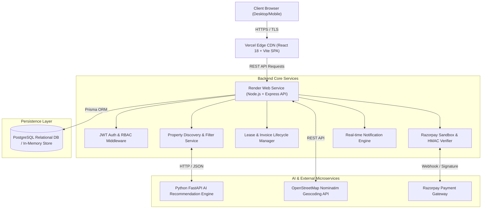
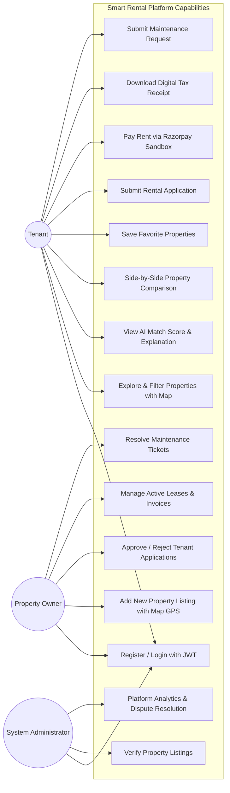
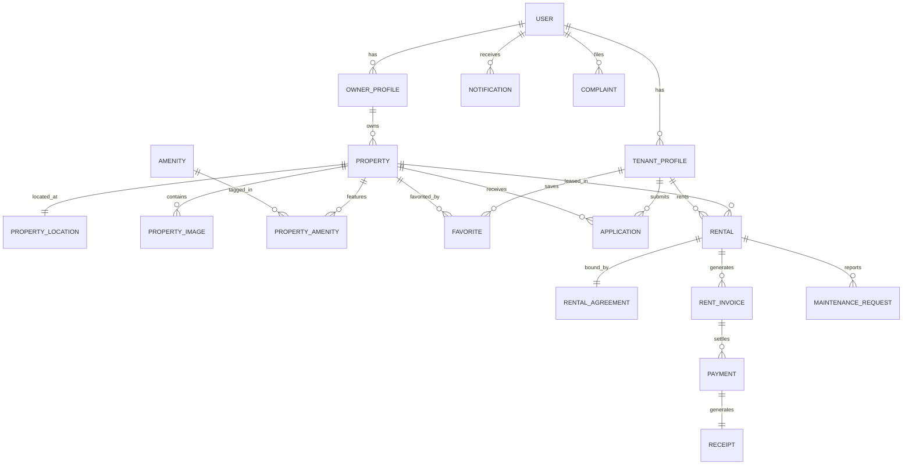
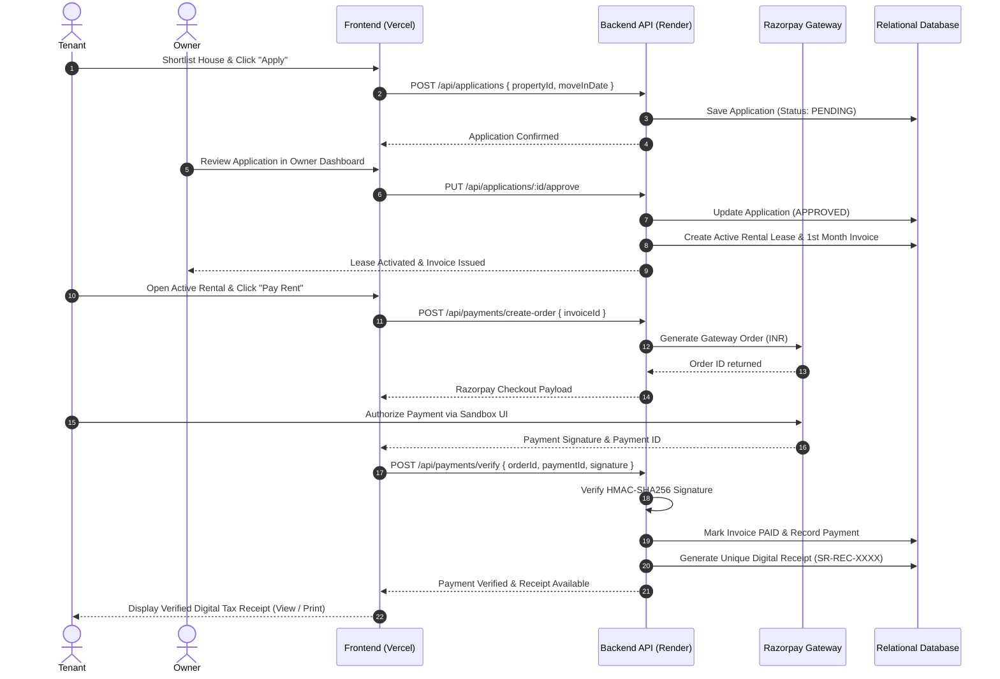
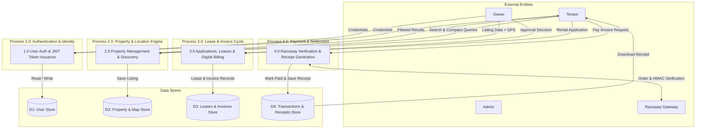

# 📐 Smart Rental Platform - UML & Engineering Architecture Diagrams

This document contains complete UML and engineering diagrams for the **Smart Rental House Management and Discovery Platform** capstone project.

---

## 1. System Architecture Diagram

---

## 2. Use Case Diagram

---

## 3. Entity-Relationship (ER) Diagram

---

## 4. Sequence Diagram: Complete Rental & Payment Cycle

---

## 5. Data Flow Diagram (DFD Level 0 & Level 1)

