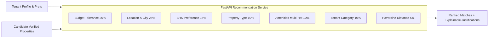

# AI Property Recommendation Engine

## 1. Engine Methodology

The recommendation engine combines **Multi-Factor Weighted Scoring** with **Content-Based Vector Cosine Similarity** to calculate personalized compatibility scores between 0% and 100%.

## 2. Multi-Factor Formula & Weight Distribution

$$\text{Match Score} = \sum_{i=1}^{n} w_i \cdot s_i$$

Where:
- **Budget Match ($w_1 = 0.25$)**: If property rent is within $[budget_{min}, budget_{max}]$, $s_1 = 1.0$. If outside, score drops smoothly using Gaussian decay based on percentage deviation:
  $$s_1 = \exp\left(-\frac{(\text{rent} - \text{budget})^2}{2\sigma^2}\right)$$
- **Location Match ($w_2 = 0.25$)**: Area string match and city match using token similarity.
- **BHK Match ($w_3 = 0.15$)**: Exact BHK match $= 1.0$; $\pm 1$ BHK $= 0.6$.
- **Property Type Match ($w_4 = 0.10$)**: Apartment, Independent House, Villa, PG similarity.
- **Amenities Match ($w_5 = 0.10$)**: Jaccard similarity across binary amenity vectors.
- **Tenant Preference ($w_6 = 0.10$)**: Matching `ANY`, `FAMILY_ONLY`, `BACHELOR_ONLY` against tenant classification.
- **Geographic Distance ($w_7 = 0.05$)**: Inverse Haversine distance score.

## 3. Explainable AI (XAI) Output
For each property, the engine outputs human-understandable justification bullets:
- `✓ Within your budget (₹15,000/mo)`
- `✓ Matches your 2 BHK preference`
- `✓ Preferred area: Koramangala, Bangalore`
- `✓ Bachelors allowed`
- `✓ Includes requested amenities: Wi-Fi, Lift, Power Backup`
