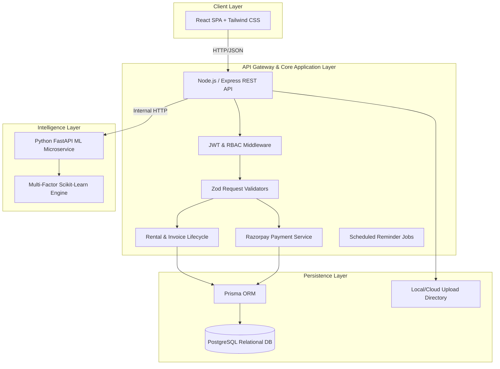

# System Architecture Documentation

## 1. High-Level Architectural Flow

The system employs a decoupled 3-tier architecture with an auxiliary machine learning microservice.

## 2. Microservice Communication
- The React Frontend communicates exclusively with the Express API via HTTPS REST endpoints with Bearer JWT tokens.
- When a tenant requests properties or initiates an AI-guided search, the Node.js API fetches verified candidate properties from PostgreSQL, packages tenant preferences and candidate vectors, and delegates ranking to the FastAPI microservice via `POST http://localhost:8000/recommendations`.
- The FastAPI service scores and annotates the candidates and returns sorted properties with match percentages (0-100%) and bulleted explanations.
- In the event of ML service unavailability, the Node.js backend features a graceful fallback to SQL-based relevance scoring so that search never halts.

## 3. Security & Data Protection
- **Passwords**: Hashed with bcrypt with a salt round factor of 10.
- **JWT Authentication**: Stateless claims with 7-day expiration and role guards (`TENANT`, `OWNER`, `ADMIN`).
- **Payment Verification**: Server-side HMAC SHA256 signature verification comparing `razorpay_order_id`, `razorpay_payment_id`, and `PAYMENT_KEY_SECRET`.
- **Upload Safety**: Strict file extension and MIME type validation, preventing arbitrary script execution.
