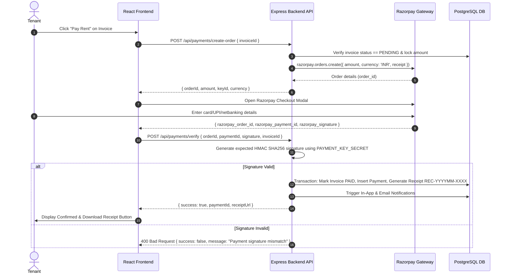

# Digital Rent Payment & Receipt Architecture

## 1. End-to-End Payment Sequence

## 2. Security & Verification Guarantees
1. **Server-Side Trust**: Payment amount is always queried directly from PostgreSQL invoice record, never trusting frontend parameters.
2. **Idempotent Invoicing**: Unique composite constraints on `(rental_id, billing_month)` prevent duplicate billing creation.
3. **Webhook Redundancy**: Webhook endpoint independently validates Razorpay HMAC signature to handle scenarios where tenant closes browser before client redirect.
4. **No Raw Card Storage**: Zero credit card, CVV, or banking details ever touch the database, adhering to strict PCI-DSS guidelines.
